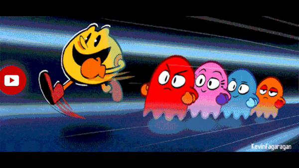

# PacShare - Facebook Messenger Bot for Limited Internet Access

 

PacShare is a Facebook Messenger chatbot that enables users with limited internet access (Meta suit only) to fetch content from various internet sources through Meta's platforms. It serves as a bridge for users to access YouTube videos, APK files, PDFs, Wikipedia articles, and AI assistance through Facebook Messenger.

## Features

- 🎥 **YouTube Video Access**: Download YouTube videos through Messenger
- 📚 **Wikipedia Articles**: Access Wikipedia articles in multiple languages
- 📱 **APK Downloads**: Get Android applications from Aptoid store
- 📄 **PDF Downloads**: Download PDF files from the internet
- 🤖 **AI Integration**: Chat with Gemini AI for assistance
- 📸 **Image Analysis**: Get AI responses for image-based queries
- 🔄 **Chunked File Transfer**: Handles large files by splitting them into manageable chunks

## How to Use

1. Start a conversation with the bot at [PacShare Facebook Page](https://www.facebook.com/pacshare1)
2. Use the following commands:

| Command | Format | Description |
|---------|--------|-------------|
| YouTube | `.yt <VIDEO_TITLE>` | Download YouTube videos |
| Wikipedia | `.wiki-<LANGUAGE_CODE> ARTICLE_TITLE` | Access Wikipedia articles |
| PDF | `.pdf <PDF_TITLE>` | Download PDF files |
| APK | `.apk <APP_TITLE>` | Download Android applications |
| AI Chat | `.ai <QUESTION>` | Get AI assistance |
| Image Analysis | Upload photo + `.ai <QUESTION>` | Get AI analysis of images |

### Supported Languages for Wikipedia
- 🇺🇸 English (en)
- 🇫🇷 French (fr)
- 🇸🇦 Arabic (ar)
- *And more...*

## File Handling

Due to Facebook Messenger's file size limitations:
- Large files are automatically split into chunks (max 25MB per chunk)
- Download our companion app to merge chunks: [Download App](https://www.facebook.com/share/p/15cYstsPxC/)

## Technical Details

### Backend Technologies
- **Language**: Golang
- **Framework**: Fiber
- **Web Scraping**: GoQuery
- **API Integration**: Facebook Messenger API
- **Architecture**: REST APIs

## Contributing

Contributions are welcome! Please feel free to submit a Pull Request.

## License

GPL3 License

## Live Demo

- Facebook Page: [@pacshare1](https://www.facebook.com/pacshare1)